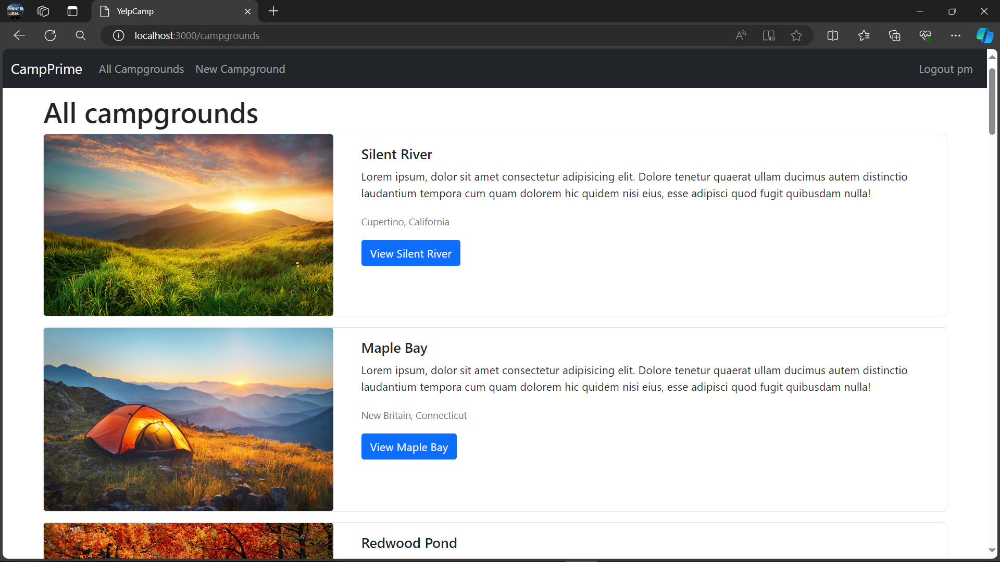
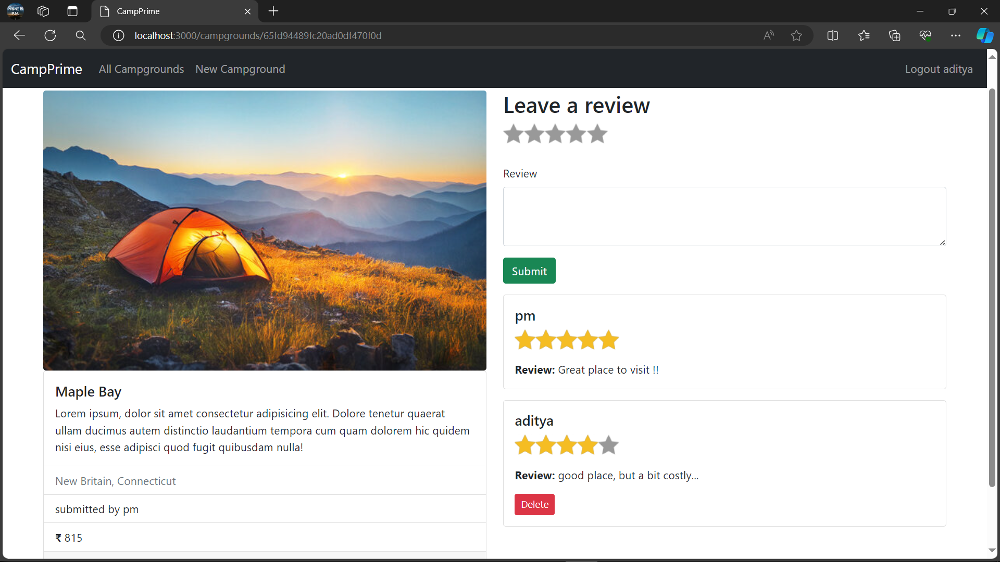

# CampPrime

CampPrime is a web application designed to facilitate campground management and sharing experiences among users. With CampPrime, users can add, modify, and delete campgrounds, upload images, provide descriptions, set rental prices, and interact with other users through reviews and ratings.

## Features

- **Campground Management**: Users can add new campgrounds, modify existing ones, or delete them.
- **Image Upload**: Upload images of campgrounds to provide visual representation.
- **Description & Pricing**: Add descriptions and set rental prices for campgrounds.
- **User Authentication**: Register and login to access personalized features.
- **Reviews & Ratings**: Users can review and rate campgrounds, sharing their experiences with others.

## Installation

To use CampPrime locally, follow these steps:

1. Clone or download the repository from GitHub:
git clone https://github.com/your-username/CampPrime.git

2. Navigate into the project directory:
cd CampPrime

3. Install the necessary dependencies using npm:
npm Install

## Usage

1. Once the dependencies are installed, start the server:
node .\app.js

2. Open your web browser and go to `http://localhost:3000/campgrounds` to access CampPrime.

3. If you're a new user, register an account. If you already have an account, log in.

4. Start exploring the app! You can add new campgrounds, upload images, provide descriptions and pricing, as well as interact with other users by reviewing and rating campgrounds.

## Technologies Used

- HTML, CSS
- EJS
- JavaScript
- Node.js, Express.js
- MongoDB
- Passport.js (for authentication)
- Cloudinary (for image upload)

## License

This project is licensed under the [MIT License](LICENSE).

## Acknowledgements

This project is in accordance with YelpCamp - the major project of the web developer bootcamp by Colt Steele on udemy.